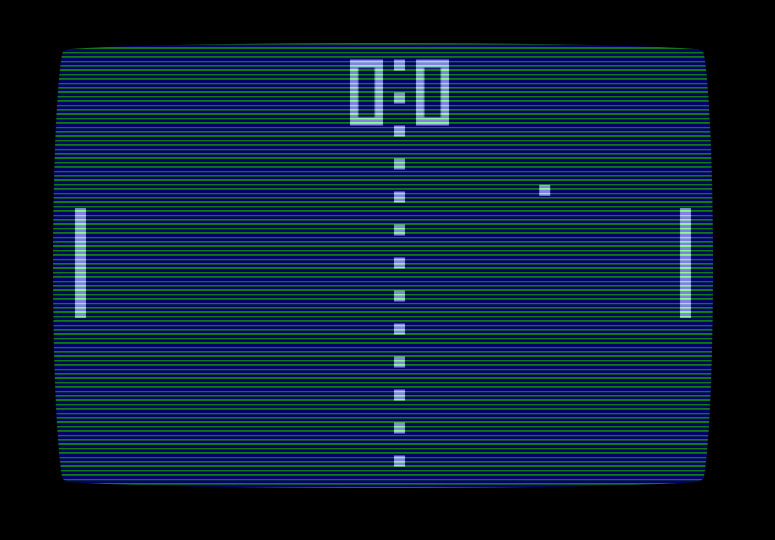

# 340-CANVAS

https://prod.liveshare.vsengsaas.visualstudio.com/join?C462CD67F39C8B584E1355FE2DE17901D828

```html
<canvas id="canvas" width="150" height="150"></canvas>
```
```js
const canvas = document.getElementById("canvas");
const ctx = canvas.getContext("2d");

```
#### Rectangle
```js
ctx.fillRect(25, 25, 100, 100);
ctx.clearRect(45, 45, 60, 60);
ctx.strokeRect(50, 50, 50, 50);
```
#### Circle
```js
ctx.beginPath();
ctx.arc(90, 65, 5, 0, Math.PI * 2, true);
ctx.stroke();
```
#### Triangle

```js
// Filled triangle
ctx.beginPath();
ctx.moveTo(25, 25);
ctx.lineTo(105, 25);
ctx.lineTo(25, 105);
ctx.fill();

// Stroked triangle
ctx.beginPath();
ctx.moveTo(125, 125);
ctx.lineTo(125, 45);
ctx.lineTo(45, 125);
ctx.closePath();
ctx.stroke();
```

### ZADANIA
ZAD34001 - Wypełnij canvas gradientem zbudowanym z prostokątów (jak poniżej) tak aby skalował się wraz z wielkością elementu (canvas)

ZAD34002 - Wypełnij canvas kółkami o losowych wymiarach, przezroczystości, i położeniu (particle effect).

ZAD34003 - Narysuj Kartkę świąteczną (wielkanocną) w canvas zawierającą jajko, kurczaczka, krzyż,. Dla zaawansowanych zając i napis wesołych świąt.

ZAD34004 - Przygotuj klon gry Arkanoid (z uproszczoną grafiką);

https://pl.wikipedia.org/wiki/Plik:Arkanoid-logo.svg


III - 

- Kajetan - https://magik244.github.io/game/
- Dominik - https://technikum-lotnicze-zdz-katowice.github.io/dominiczkanoid/
- Oliwier - https://czarodziej64.github.io/oliwieroid/
- Kuba - https://technikum-lotnicze-zdz-katowice.github.io/arkanoid-kuba/
- Igor - https://technikum-lotnicze-zdz-katowice.github.io/igor-newrepo/
- Maks - https://makssek664.github.io/ball

ZAD34005 - Przygotuj klon klasycznej gry PONG 
https://pl.wikipedia.org/wiki/Pong



### Tutorials

https://developer.mozilla.org/en-US/docs/Web/API/Canvas_API/Tutorial?retiredLocale=pl

### Info

https://pl.wikipedia.org/wiki/Arkanoid
https://www.ponggame.org/

### Links
https://fontstruct.com/fontstructions/show/2399842/pong-65
https://fontstruct.com/fontstructions/show/2399648/ataris-pong-score
https://dev.to/ekeijl/retro-crt-terminal-screen-in-css-js-4afh
https://www.creativebloq.com/how-to/add-svg-filters-with-css
